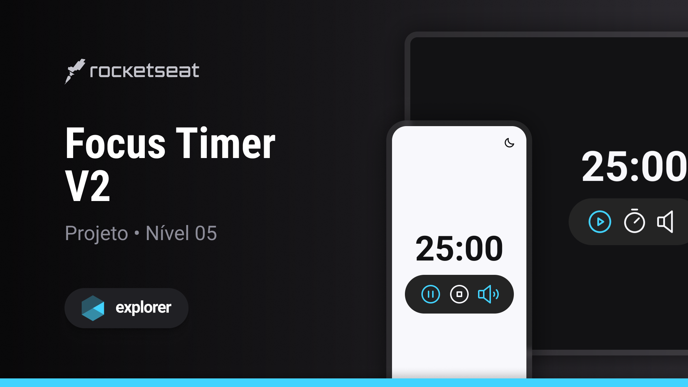

<h1 align="center"> Focus Timer - Pomodoro </h1>

  <a href="#-tecnologias">Tecnologias</a>&nbsp;&nbsp;&nbsp;|&nbsp;&nbsp;&nbsp;
  <a href="#-projeto">Projeto</a>&nbsp;&nbsp;&nbsp;|&nbsp;&nbsp;&nbsp;
  <a href="#-layout">Layout</a>&nbsp;&nbsp;&nbsp;|&nbsp;&nbsp;&nbsp;

 

## 🚀 Tecnologias

Esse projeto foi desenvolvido com as seguintes tecnologias:

- Estrutura de dados HTML
- CSS
- módulos ES6
- Funções no Javascript
- Manipulação da DOM
- Funções *callback*
- Figma

## 💻 Projeto

Focus Tmer - Pomodoro.

- [Acesse o projeto finalizado, online](https://jhonimattos.github.io/focustimer).

## 🔖 Layout

Você pode visualizar o layout do projeto através [DESSE LINK](https://www.figma.com/design/wYla1IbrH1TwlvRw4RTgo6/Focus-Timer-V2-%E2%80%A2-Projeto-Explorer-(Community)?node-id=1422-28&t=9hucObViuKsojE3u-0) para acessá-lo.
